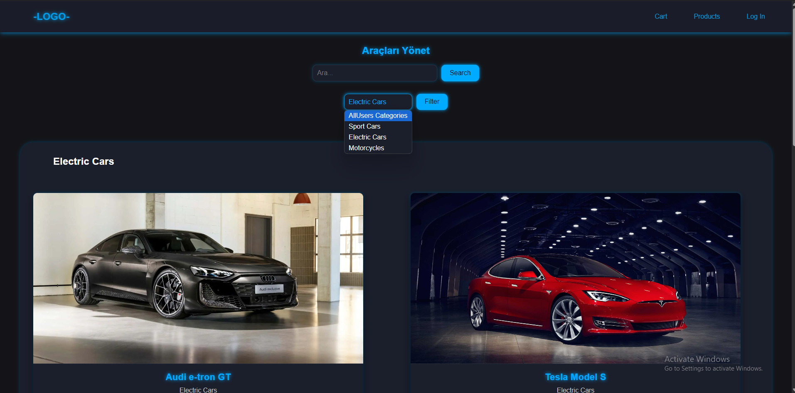
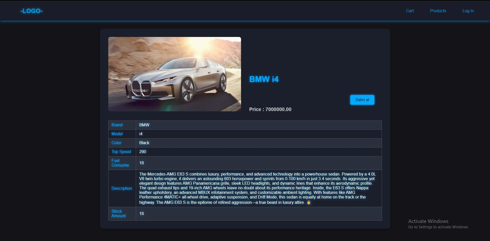
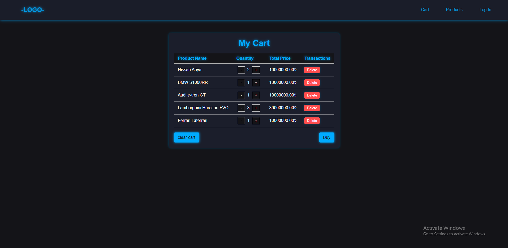
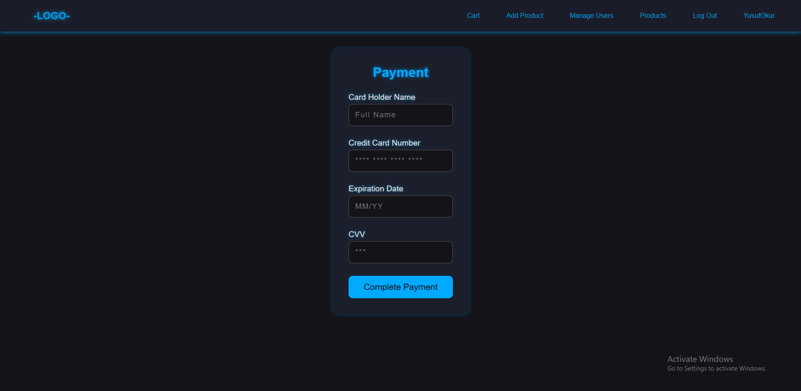
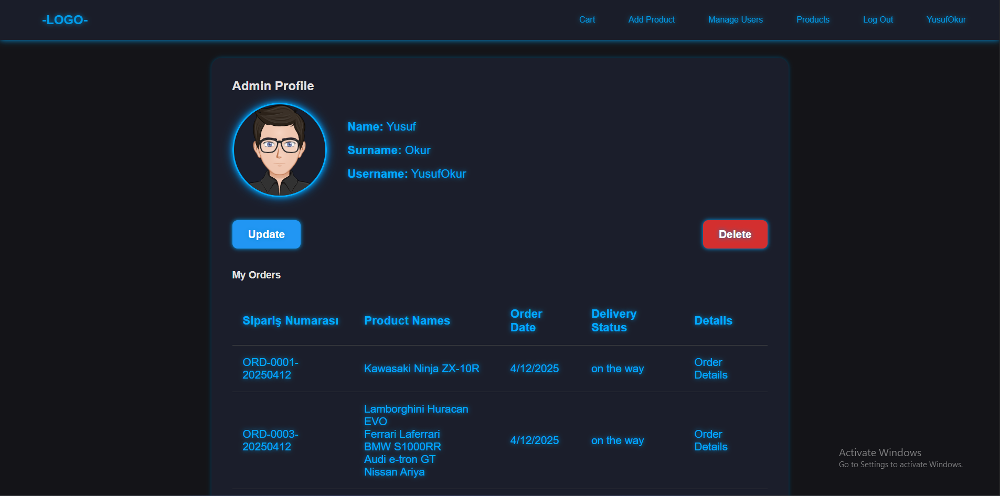
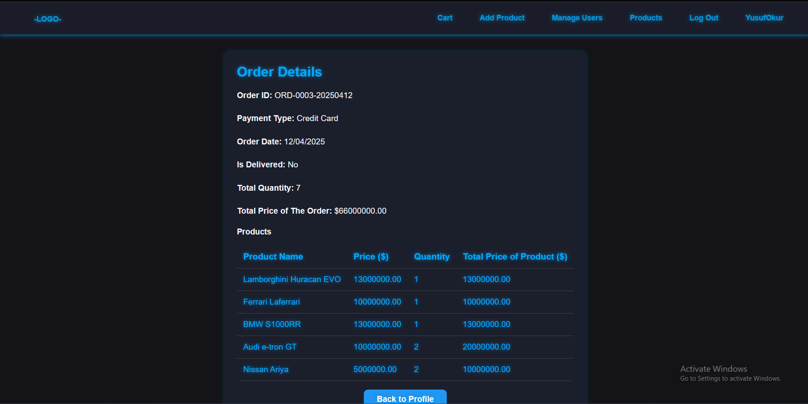
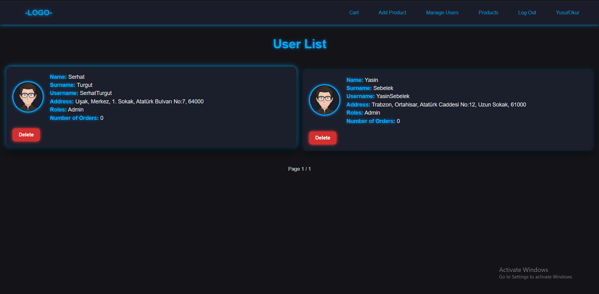

# 🚗 Vehicle Management Platform

Welcome to the **ultimate hub for vehicle enthusiasts**! This platform is designed to revolutionize the way users explore, purchase, and manage vehicles. Whether you're searching for the perfect electric car, a high-speed motorcycle, or your dream car, this application delivers an unmatched user experience.

Admins, we've got you covered too! With powerful tools for managing inventory, tracking orders, and handling user accounts, this platform empowers you to run the show effortlessly.

---

## 🛠️ Technology Stack
- **ASP.NET Core**: The backbone of our API and MVC structure.
- **Entity Framework Core**: Effortlessly bridges the gap between code and data.
- **PostgreSQL**: Rock-solid data management for relational storage.
- **ASP.NET Identity**: Built-in user authentication and role-based security.

---

## 🏗️ Database Design
Our robust database ensures seamless operations with well-defined relationships:

- **Users**:
- **Roles**:
- **UserRole**:
- **Products**:
- **Orders**:
- **OrderProducts**:
- **Payments**:
- **Categories**:
- **Addresses**:

---

## 🔒 Authentication & Authorization
With **ASP.NET Identity**, your data is protected, and access is under control:
- **Customers**: Shop, manage orders, and check out securely.
- **Admins**: Oversee the entire platform, from inventory to user management.

---

## 🚀 Application Workflow

### For Customers:
1. **Registration & Login**: Create an account and start exploring immediately.
2. **Browse Vehicles**: Filter by category (e.g., electric cars, motorcycles) and check out details.
3. **Cart Management**:
   - Add your favorites.
   - Adjust quantities or remove items.
4. **Order Placement**:
   - Checkout with ease and track your order history.

### For Admins:
- **Inventory Management**: Add, edit, or deactivate vehicles.
- **User Management**: View and manage customer accounts.
- **Order Tracking**: Keep an eye on all orders.

---

## 🌟 Core Functionalities

### 🛒 Cart & Checkout
- Dynamic cart for adding, removing, and updating items.
- Address validation ensures smooth checkout.
- Payments are securely processed to mark orders as complete.

### 🔧 Admin Features
- Comprehensive control over the product catalog.
- Easy management of customer accounts.
- Access all order details for efficient oversight.

---

## 🖼️ Visuals

Here’s a glimpse of the **Vehicle Management Platform**:

*Main Dashboard*

*Main Dashboard*

*Browse Vehicles*

*Browse Vehicle Details*

*See Cart*

*Payment*

*User Profile*

*Order Details*

*Admin Panel*

---